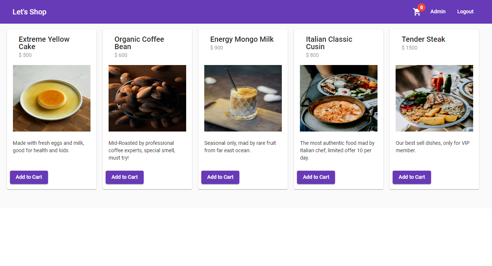

# Django + DRF + MongoDB + Angular Shopping-Cart
Simple shopping cart application

## Simple shopping cart application

<p align="center">

  
</p>

## Overview - [Live Demo](https://test.com)

A shopping cart is built with Angular, TypeScript, Django, Django Restful Framwork, Material UI and some other 3nd packages. 

#### Features

- JWT authentication and authorization.
- Add and remove products from the products list or cart.  
- Admin page to manage products.
- Allow images upload to server and display on UI.

<!--
## Getting started

Try playing with the code on CodeSandbox :)

[](https://codesandbox.io/s/74rykw70qq)
 -->

## Build/Run

#### Requirements

- Docker

```javascript

/* All you need to do is run the docker-compose file */
sudo docker-compose up

/* vist port:4201 on your local machine, default account/passwrd: super  */
http://localhost:4201

```
